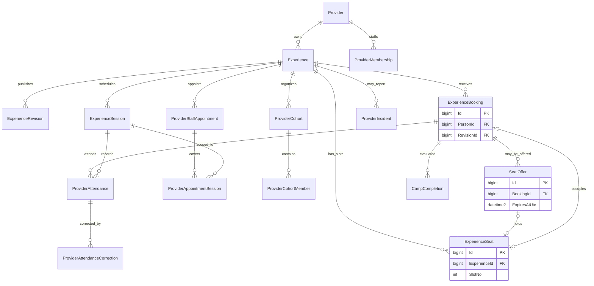

# Provider booking, waiting list and camp ERD

```mermaid
erDiagram
  Provider ||--o{ Experience : owns
  Provider ||--o{ ProviderMembership : staffs
  Experience ||--o{ ExperienceRevision : publishes
  Experience ||--o{ ExperienceSession : schedules
  Experience ||--o{ ExperienceSeat : has_slots
  Experience ||--o{ ExperienceBooking : receives
  ExperienceBooking ||--o{ SeatOffer : may_be_offered
  SeatOffer |o--o| ExperienceSeat : holds
  ExperienceBooking |o--o| ExperienceSeat : occupies
  Experience ||--o{ ProviderStaffAppointment : appoints
  ProviderStaffAppointment ||--o{ ProviderAppointmentSession : covers
  ExperienceSession ||--o{ ProviderAppointmentSession : scoped_to
  Experience ||--o{ ProviderCohort : organizes
  ProviderCohort ||--o{ ProviderCohortMember : contains
  ExperienceBooking ||--o{ ProviderAttendance : attends
  ExperienceSession ||--o{ ProviderAttendance : records
  ProviderAttendance ||--o{ ProviderAttendanceCorrection : corrected_by
  ExperienceBooking ||--o{ CampCompletion : evaluated
  Experience ||--o{ ProviderIncident : may_report
  ExperienceSeat {
    bigint Id PK
    bigint ExperienceId FK
    int SlotNo
  }
  SeatOffer {
    bigint Id PK
    bigint BookingId FK
    datetime2 ExpiresAtUtc
  }
  ExperienceBooking {
    bigint Id PK
    bigint PersonId FK
    bigint RevisionId FK
  }
```

Confirmed booking and active offer each occupy exactly one slot. Provider Cohort is an operational safety assignment and never owns a Group Garden.
