# DeepSprout v5 — Entity Relationship Diagrams

> Generated from the model. Each diagram shows keys, foreign keys and status columns only (full columns in the data dictionary). Dashed boxes are entities from other schemas shown as stubs. `||--o{` = one to many; `|o--o{` = optional parent.

## 1. Schema dependencies

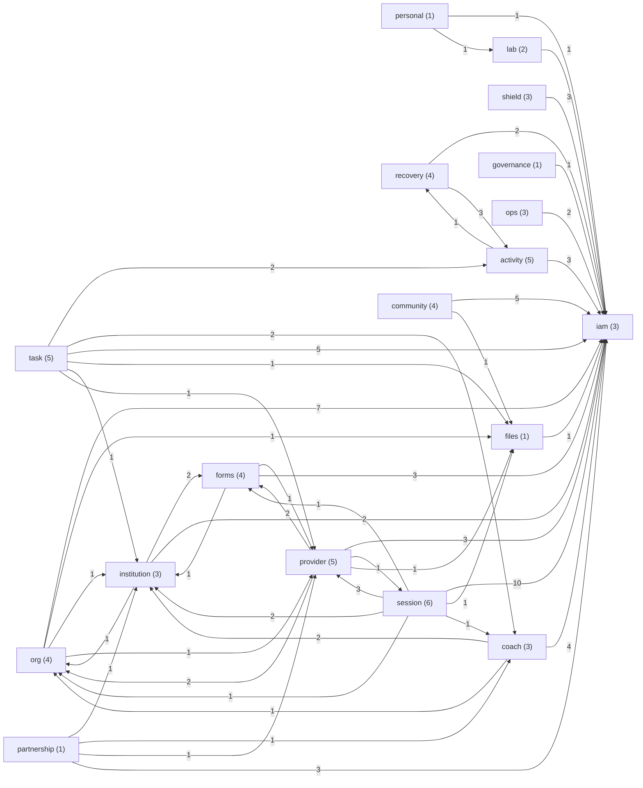
```mermaid
flowchart LR
  iam["iam (3)"]
  org["org (4)"]
  personal["personal (1)"]
  lab["lab (2)"]
  recovery["recovery (4)"]
  activity["activity (5)"]
  shield["shield (3)"]
  institution["institution (3)"]
  coach["coach (3)"]
  task["task (5)"]
  session["session (6)"]
  provider["provider (5)"]
  forms["forms (4)"]
  community["community (4)"]
  partnership["partnership (1)"]
  governance["governance (1)"]
  ops["ops (3)"]
  files["files (1)"]
  org -->|7| iam
  org -->|1| files
  org -->|1| institution
  org -->|1| provider
  personal -->|1| iam
  personal -->|1| lab
  lab -->|1| iam
  recovery -->|2| iam
  recovery -->|3| activity
  activity -->|3| iam
  activity -->|1| recovery
  shield -->|3| iam
  institution -->|1| org
  institution -->|2| forms
  institution -->|2| iam
  coach -->|4| iam
  coach -->|2| institution
  coach -->|1| org
  task -->|2| activity
  task -->|2| coach
  task -->|5| iam
  task -->|1| files
  task -->|1| institution
  task -->|1| provider
  session -->|2| institution
  session -->|3| provider
  session -->|10| iam
  session -->|1| org
  session -->|1| forms
  session -->|1| files
  session -->|1| coach
  provider -->|2| org
  provider -->|2| forms
  provider -->|3| iam
  provider -->|1| session
  provider -->|1| files
  forms -->|1| institution
  forms -->|1| provider
  forms -->|3| iam
  community -->|5| iam
  community -->|1| files
  partnership -->|1| institution
  partnership -->|1| coach
  partnership -->|1| provider
  partnership -->|3| iam
  governance -->|1| iam
  ops -->|2| iam
  files -->|1| iam
```

Arrow = "has foreign keys into"; the number is how many FK columns cross that boundary.

## 2. iam

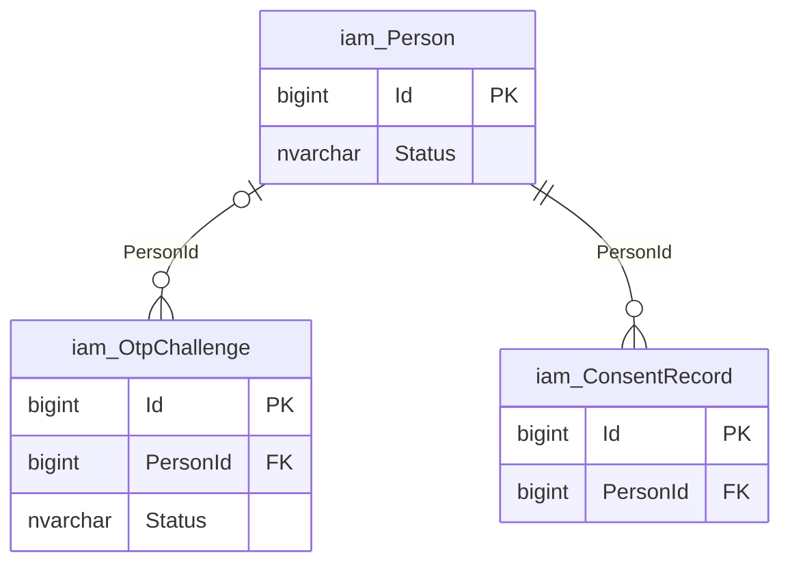
```mermaid
erDiagram
  iam_Person {
    bigint Id PK
    nvarchar Status
  }
  iam_OtpChallenge {
    bigint Id PK
    bigint PersonId FK
    nvarchar Status
  }
  iam_Person |o--o{ iam_OtpChallenge : "PersonId"
  iam_ConsentRecord {
    bigint Id PK
    bigint PersonId FK
  }
  iam_Person ||--o{ iam_ConsentRecord : "PersonId"
```

## 3. org

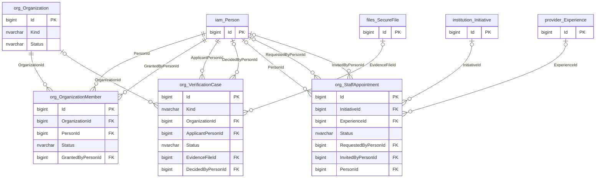
```mermaid
erDiagram
  org_Organization {
    bigint Id PK
    nvarchar Kind
    nvarchar Status
  }
  org_OrganizationMember {
    bigint Id PK
    bigint OrganizationId FK
    bigint PersonId FK
    nvarchar Status
    bigint GrantedByPersonId FK
  }
  org_Organization ||--o{ org_OrganizationMember : "OrganizationId"
  iam_Person ||--o{ org_OrganizationMember : "PersonId"
  iam_Person ||--o{ org_OrganizationMember : "GrantedByPersonId"
  org_VerificationCase {
    bigint Id PK
    nvarchar Kind
    bigint OrganizationId FK
    bigint ApplicantPersonId FK
    nvarchar Status
    bigint EvidenceFileId FK
    bigint DecidedByPersonId FK
  }
  org_Organization |o--o{ org_VerificationCase : "OrganizationId"
  iam_Person ||--o{ org_VerificationCase : "ApplicantPersonId"
  iam_Person |o--o{ org_VerificationCase : "DecidedByPersonId"
  files_SecureFile |o--o{ org_VerificationCase : "EvidenceFileId"
  org_StaffAppointment {
    bigint Id PK
    bigint InitiativeId FK
    bigint ExperienceId FK
    nvarchar Status
    bigint RequestedByPersonId FK
    bigint InvitedByPersonId FK
    bigint PersonId FK
  }
  institution_Initiative |o--o{ org_StaffAppointment : "InitiativeId"
  provider_Experience |o--o{ org_StaffAppointment : "ExperienceId"
  iam_Person |o--o{ org_StaffAppointment : "PersonId"
  iam_Person |o--o{ org_StaffAppointment : "RequestedByPersonId"
  iam_Person |o--o{ org_StaffAppointment : "InvitedByPersonId"
  iam_Person {
    bigint Id PK
  }
  files_SecureFile {
    bigint Id PK
  }
  institution_Initiative {
    bigint Id PK
  }
  provider_Experience {
    bigint Id PK
  }
```

## 4. personal

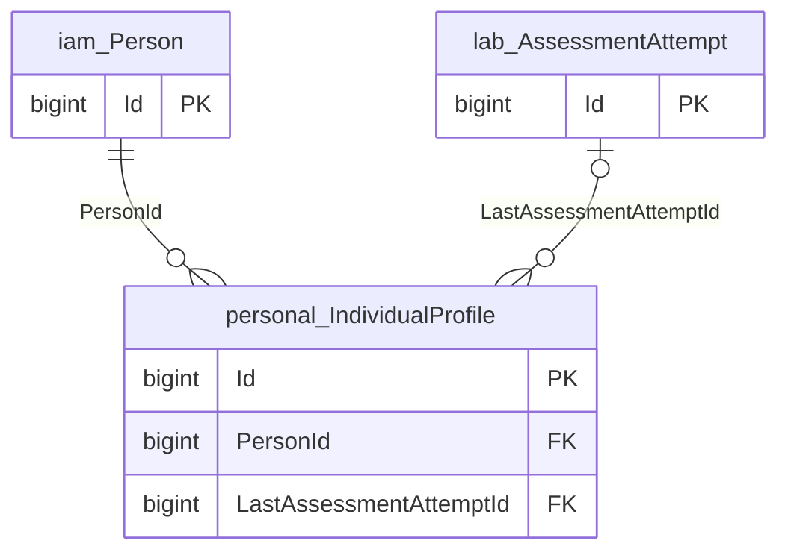
```mermaid
erDiagram
  personal_IndividualProfile {
    bigint Id PK
    bigint PersonId FK
    bigint LastAssessmentAttemptId FK
  }
  iam_Person ||--o{ personal_IndividualProfile : "PersonId"
  lab_AssessmentAttempt |o--o{ personal_IndividualProfile : "LastAssessmentAttemptId"
  iam_Person {
    bigint Id PK
  }
  lab_AssessmentAttempt {
    bigint Id PK
  }
```

## 5. lab

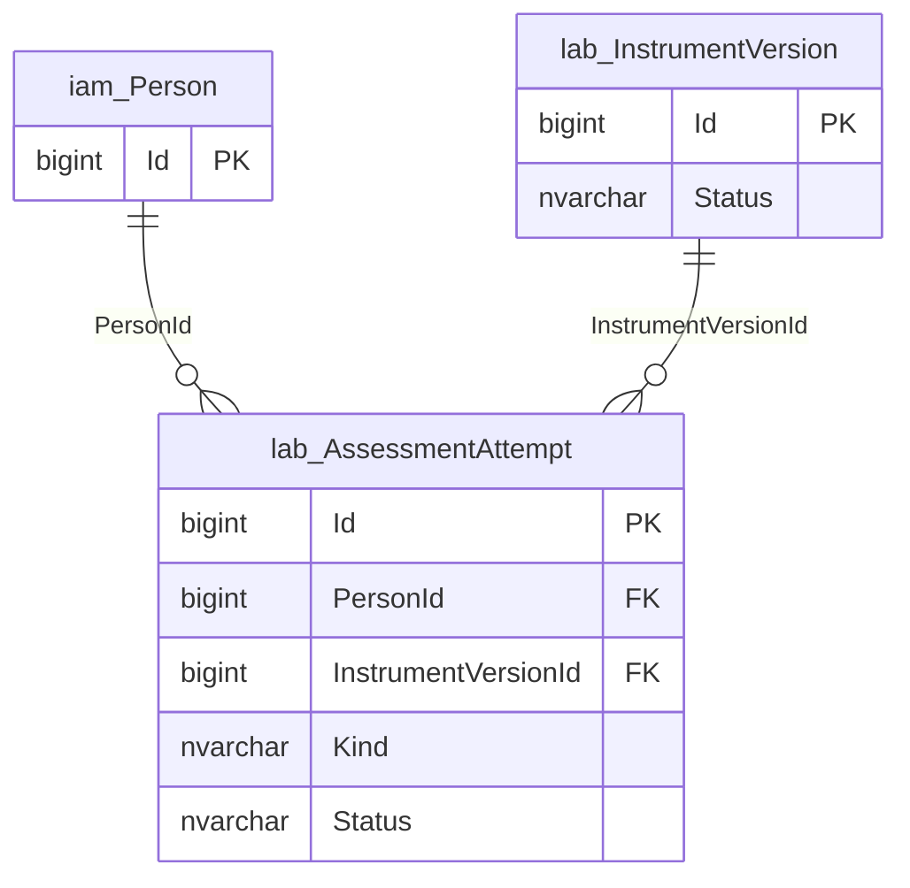
```mermaid
erDiagram
  lab_InstrumentVersion {
    bigint Id PK
    nvarchar Status
  }
  lab_AssessmentAttempt {
    bigint Id PK
    bigint PersonId FK
    bigint InstrumentVersionId FK
    nvarchar Kind
    nvarchar Status
  }
  iam_Person ||--o{ lab_AssessmentAttempt : "PersonId"
  lab_InstrumentVersion ||--o{ lab_AssessmentAttempt : "InstrumentVersionId"
  iam_Person {
    bigint Id PK
  }
```

## 6. recovery

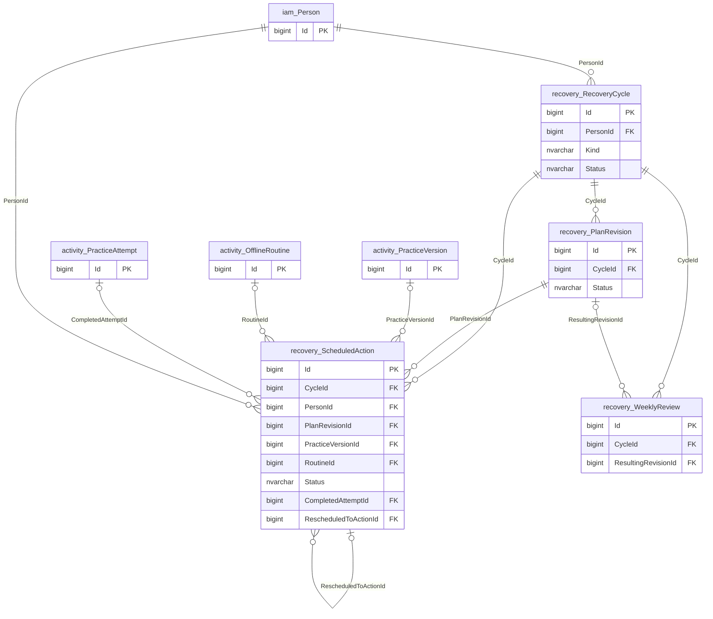
```mermaid
erDiagram
  recovery_RecoveryCycle {
    bigint Id PK
    bigint PersonId FK
    nvarchar Kind
    nvarchar Status
  }
  iam_Person ||--o{ recovery_RecoveryCycle : "PersonId"
  recovery_PlanRevision {
    bigint Id PK
    bigint CycleId FK
    nvarchar Status
  }
  recovery_RecoveryCycle ||--o{ recovery_PlanRevision : "CycleId"
  recovery_ScheduledAction {
    bigint Id PK
    bigint CycleId FK
    bigint PersonId FK
    bigint PlanRevisionId FK
    bigint PracticeVersionId FK
    bigint RoutineId FK
    nvarchar Status
    bigint CompletedAttemptId FK
    bigint RescheduledToActionId FK
  }
  recovery_RecoveryCycle ||--o{ recovery_ScheduledAction : "CycleId"
  recovery_PlanRevision ||--o{ recovery_ScheduledAction : "PlanRevisionId"
  activity_PracticeVersion |o--o{ recovery_ScheduledAction : "PracticeVersionId"
  activity_OfflineRoutine |o--o{ recovery_ScheduledAction : "RoutineId"
  activity_PracticeAttempt |o--o{ recovery_ScheduledAction : "CompletedAttemptId"
  recovery_ScheduledAction |o--o{ recovery_ScheduledAction : "RescheduledToActionId"
  iam_Person ||--o{ recovery_ScheduledAction : "PersonId"
  recovery_WeeklyReview {
    bigint Id PK
    bigint CycleId FK
    bigint ResultingRevisionId FK
  }
  recovery_RecoveryCycle ||--o{ recovery_WeeklyReview : "CycleId"
  recovery_PlanRevision |o--o{ recovery_WeeklyReview : "ResultingRevisionId"
  iam_Person {
    bigint Id PK
  }
  activity_PracticeVersion {
    bigint Id PK
  }
  activity_OfflineRoutine {
    bigint Id PK
  }
  activity_PracticeAttempt {
    bigint Id PK
  }
```

## 7. activity

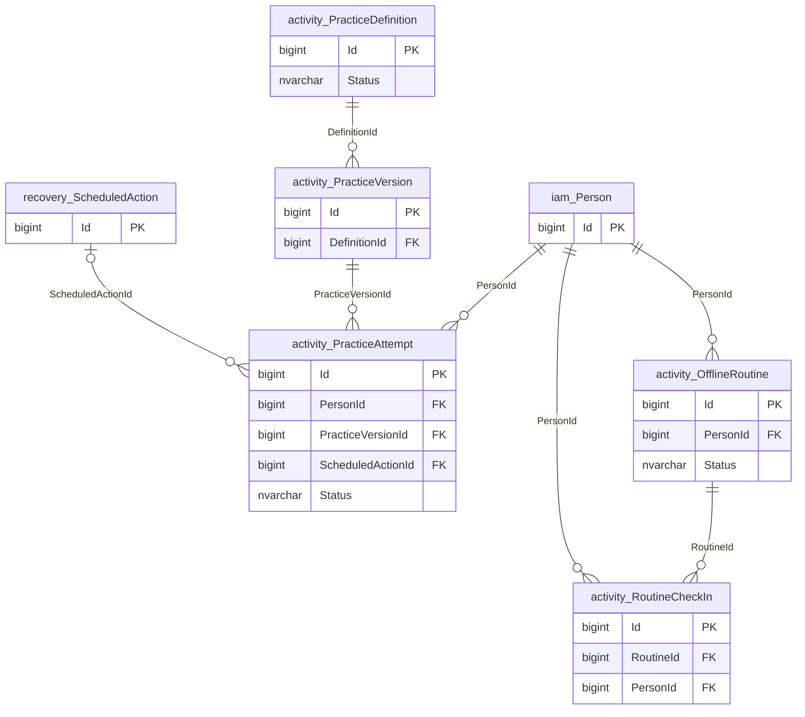
```mermaid
erDiagram
  activity_PracticeDefinition {
    bigint Id PK
    nvarchar Status
  }
  activity_PracticeVersion {
    bigint Id PK
    bigint DefinitionId FK
  }
  activity_PracticeDefinition ||--o{ activity_PracticeVersion : "DefinitionId"
  activity_PracticeAttempt {
    bigint Id PK
    bigint PersonId FK
    bigint PracticeVersionId FK
    bigint ScheduledActionId FK
    nvarchar Status
  }
  iam_Person ||--o{ activity_PracticeAttempt : "PersonId"
  activity_PracticeVersion ||--o{ activity_PracticeAttempt : "PracticeVersionId"
  recovery_ScheduledAction |o--o{ activity_PracticeAttempt : "ScheduledActionId"
  activity_OfflineRoutine {
    bigint Id PK
    bigint PersonId FK
    nvarchar Status
  }
  iam_Person ||--o{ activity_OfflineRoutine : "PersonId"
  activity_RoutineCheckIn {
    bigint Id PK
    bigint RoutineId FK
    bigint PersonId FK
  }
  activity_OfflineRoutine ||--o{ activity_RoutineCheckIn : "RoutineId"
  iam_Person ||--o{ activity_RoutineCheckIn : "PersonId"
  iam_Person {
    bigint Id PK
  }
  recovery_ScheduledAction {
    bigint Id PK
  }
```

## 8. shield

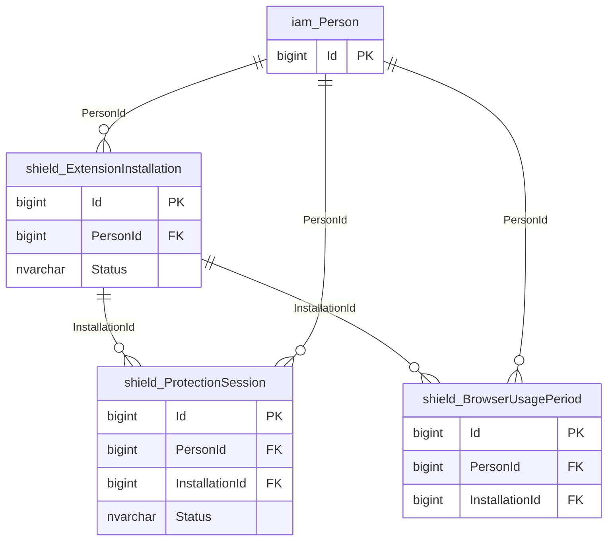
```mermaid
erDiagram
  shield_ExtensionInstallation {
    bigint Id PK
    bigint PersonId FK
    nvarchar Status
  }
  iam_Person ||--o{ shield_ExtensionInstallation : "PersonId"
  shield_ProtectionSession {
    bigint Id PK
    bigint PersonId FK
    bigint InstallationId FK
    nvarchar Status
  }
  shield_ExtensionInstallation ||--o{ shield_ProtectionSession : "InstallationId"
  iam_Person ||--o{ shield_ProtectionSession : "PersonId"
  shield_BrowserUsagePeriod {
    bigint Id PK
    bigint PersonId FK
    bigint InstallationId FK
  }
  shield_ExtensionInstallation ||--o{ shield_BrowserUsagePeriod : "InstallationId"
  iam_Person ||--o{ shield_BrowserUsagePeriod : "PersonId"
  iam_Person {
    bigint Id PK
  }
```

## 9. institution

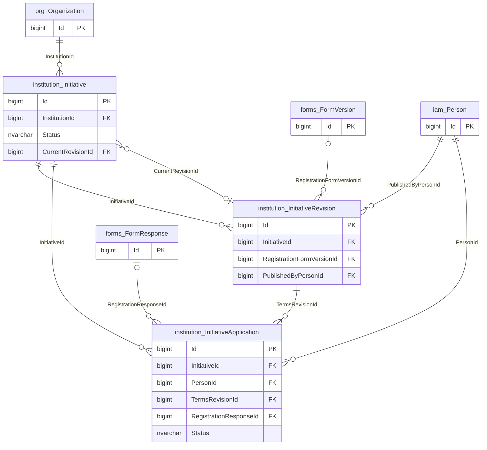
```mermaid
erDiagram
  institution_Initiative {
    bigint Id PK
    bigint InstitutionId FK
    nvarchar Status
    bigint CurrentRevisionId FK
  }
  org_Organization ||--o{ institution_Initiative : "InstitutionId"
  institution_InitiativeRevision |o--o{ institution_Initiative : "CurrentRevisionId"
  institution_InitiativeRevision {
    bigint Id PK
    bigint InitiativeId FK
    bigint RegistrationFormVersionId FK
    bigint PublishedByPersonId FK
  }
  institution_Initiative ||--o{ institution_InitiativeRevision : "InitiativeId"
  forms_FormVersion |o--o{ institution_InitiativeRevision : "RegistrationFormVersionId"
  iam_Person ||--o{ institution_InitiativeRevision : "PublishedByPersonId"
  institution_InitiativeApplication {
    bigint Id PK
    bigint InitiativeId FK
    bigint PersonId FK
    bigint TermsRevisionId FK
    bigint RegistrationResponseId FK
    nvarchar Status
  }
  institution_Initiative ||--o{ institution_InitiativeApplication : "InitiativeId"
  iam_Person ||--o{ institution_InitiativeApplication : "PersonId"
  institution_InitiativeRevision ||--o{ institution_InitiativeApplication : "TermsRevisionId"
  forms_FormResponse |o--o{ institution_InitiativeApplication : "RegistrationResponseId"
  org_Organization {
    bigint Id PK
  }
  forms_FormVersion {
    bigint Id PK
  }
  iam_Person {
    bigint Id PK
  }
  forms_FormResponse {
    bigint Id PK
  }
```

## 10. coach

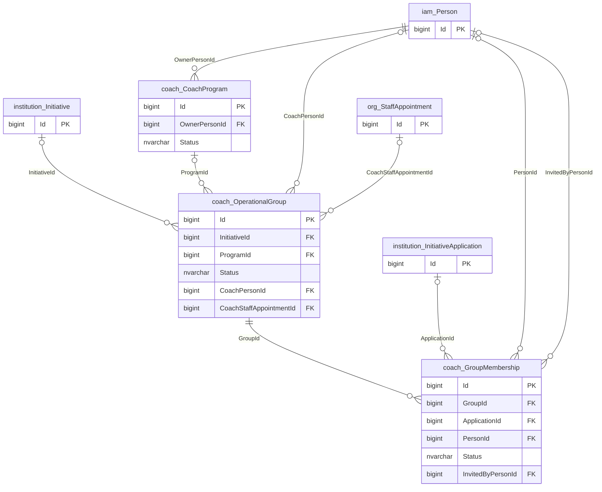
```mermaid
erDiagram
  coach_CoachProgram {
    bigint Id PK
    bigint OwnerPersonId FK
    nvarchar Status
  }
  iam_Person ||--o{ coach_CoachProgram : "OwnerPersonId"
  coach_OperationalGroup {
    bigint Id PK
    bigint InitiativeId FK
    bigint ProgramId FK
    nvarchar Status
    bigint CoachPersonId FK
    bigint CoachStaffAppointmentId FK
  }
  institution_Initiative |o--o{ coach_OperationalGroup : "InitiativeId"
  coach_CoachProgram |o--o{ coach_OperationalGroup : "ProgramId"
  iam_Person |o--o{ coach_OperationalGroup : "CoachPersonId"
  org_StaffAppointment |o--o{ coach_OperationalGroup : "CoachStaffAppointmentId"
  coach_GroupMembership {
    bigint Id PK
    bigint GroupId FK
    bigint ApplicationId FK
    bigint PersonId FK
    nvarchar Status
    bigint InvitedByPersonId FK
  }
  coach_OperationalGroup ||--o{ coach_GroupMembership : "GroupId"
  institution_InitiativeApplication |o--o{ coach_GroupMembership : "ApplicationId"
  iam_Person |o--o{ coach_GroupMembership : "PersonId"
  iam_Person |o--o{ coach_GroupMembership : "InvitedByPersonId"
  iam_Person {
    bigint Id PK
  }
  institution_Initiative {
    bigint Id PK
  }
  org_StaffAppointment {
    bigint Id PK
  }
  institution_InitiativeApplication {
    bigint Id PK
  }
```

## 11. task

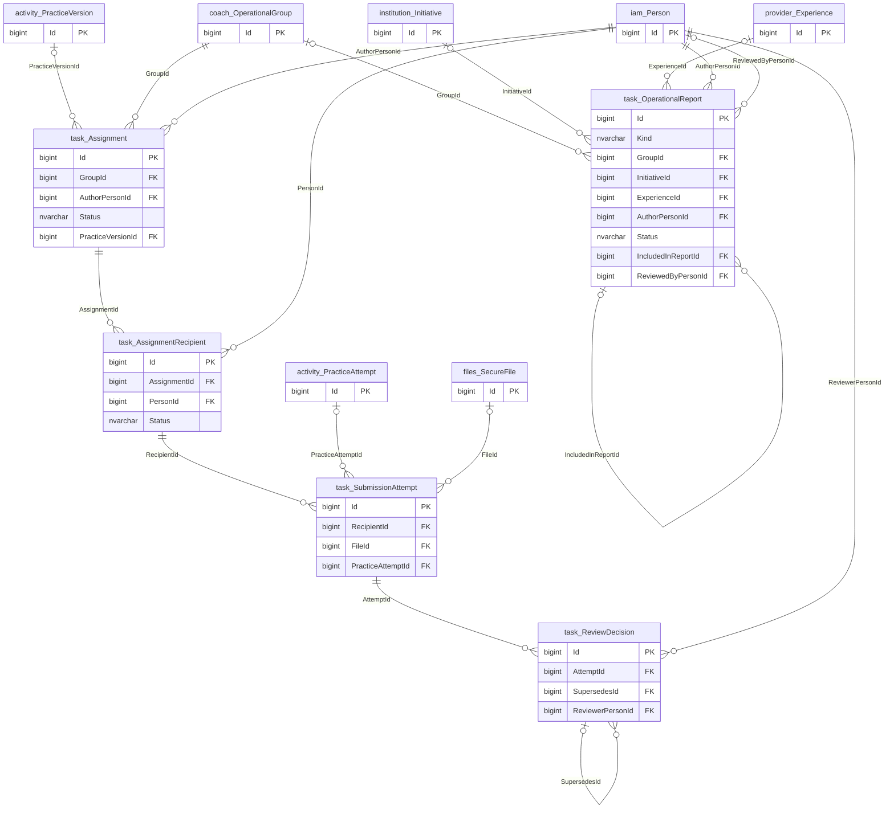
```mermaid
erDiagram
  task_Assignment {
    bigint Id PK
    bigint GroupId FK
    bigint AuthorPersonId FK
    nvarchar Status
    bigint PracticeVersionId FK
  }
  activity_PracticeVersion |o--o{ task_Assignment : "PracticeVersionId"
  coach_OperationalGroup ||--o{ task_Assignment : "GroupId"
  iam_Person ||--o{ task_Assignment : "AuthorPersonId"
  task_AssignmentRecipient {
    bigint Id PK
    bigint AssignmentId FK
    bigint PersonId FK
    nvarchar Status
  }
  task_Assignment ||--o{ task_AssignmentRecipient : "AssignmentId"
  iam_Person ||--o{ task_AssignmentRecipient : "PersonId"
  task_SubmissionAttempt {
    bigint Id PK
    bigint RecipientId FK
    bigint FileId FK
    bigint PracticeAttemptId FK
  }
  task_AssignmentRecipient ||--o{ task_SubmissionAttempt : "RecipientId"
  activity_PracticeAttempt |o--o{ task_SubmissionAttempt : "PracticeAttemptId"
  files_SecureFile |o--o{ task_SubmissionAttempt : "FileId"
  task_ReviewDecision {
    bigint Id PK
    bigint AttemptId FK
    bigint SupersedesId FK
    bigint ReviewerPersonId FK
  }
  task_SubmissionAttempt ||--o{ task_ReviewDecision : "AttemptId"
  task_ReviewDecision |o--o{ task_ReviewDecision : "SupersedesId"
  iam_Person ||--o{ task_ReviewDecision : "ReviewerPersonId"
  task_OperationalReport {
    bigint Id PK
    nvarchar Kind
    bigint GroupId FK
    bigint InitiativeId FK
    bigint ExperienceId FK
    bigint AuthorPersonId FK
    nvarchar Status
    bigint IncludedInReportId FK
    bigint ReviewedByPersonId FK
  }
  coach_OperationalGroup |o--o{ task_OperationalReport : "GroupId"
  institution_Initiative |o--o{ task_OperationalReport : "InitiativeId"
  provider_Experience |o--o{ task_OperationalReport : "ExperienceId"
  task_OperationalReport |o--o{ task_OperationalReport : "IncludedInReportId"
  iam_Person ||--o{ task_OperationalReport : "AuthorPersonId"
  iam_Person |o--o{ task_OperationalReport : "ReviewedByPersonId"
  activity_PracticeVersion {
    bigint Id PK
  }
  coach_OperationalGroup {
    bigint Id PK
  }
  iam_Person {
    bigint Id PK
  }
  activity_PracticeAttempt {
    bigint Id PK
  }
  files_SecureFile {
    bigint Id PK
  }
  institution_Initiative {
    bigint Id PK
  }
  provider_Experience {
    bigint Id PK
  }
```

## 12. session

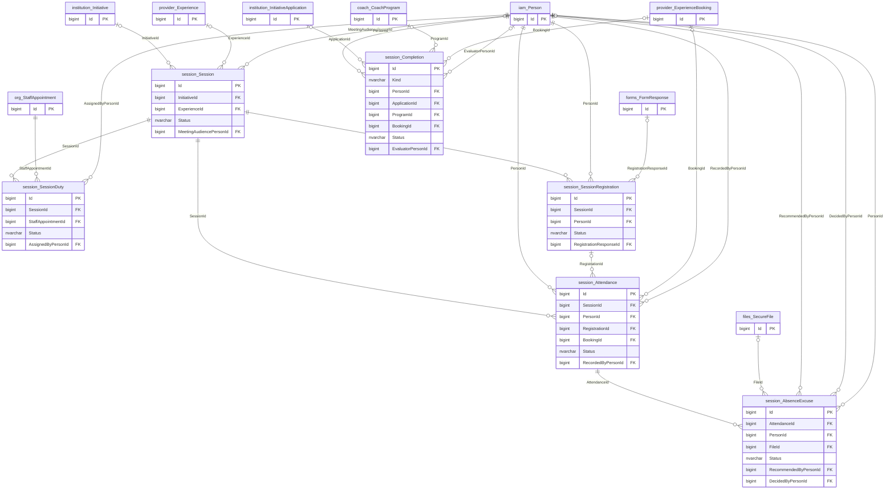
```mermaid
erDiagram
  session_Session {
    bigint Id PK
    bigint InitiativeId FK
    bigint ExperienceId FK
    nvarchar Status
    bigint MeetingAudiencePersonId FK
  }
  institution_Initiative |o--o{ session_Session : "InitiativeId"
  provider_Experience |o--o{ session_Session : "ExperienceId"
  iam_Person |o--o{ session_Session : "MeetingAudiencePersonId"
  session_SessionDuty {
    bigint Id PK
    bigint SessionId FK
    bigint StaffAppointmentId FK
    nvarchar Status
    bigint AssignedByPersonId FK
  }
  session_Session ||--o{ session_SessionDuty : "SessionId"
  org_StaffAppointment ||--o{ session_SessionDuty : "StaffAppointmentId"
  iam_Person ||--o{ session_SessionDuty : "AssignedByPersonId"
  session_SessionRegistration {
    bigint Id PK
    bigint SessionId FK
    bigint PersonId FK
    nvarchar Status
    bigint RegistrationResponseId FK
  }
  session_Session ||--o{ session_SessionRegistration : "SessionId"
  iam_Person ||--o{ session_SessionRegistration : "PersonId"
  forms_FormResponse |o--o{ session_SessionRegistration : "RegistrationResponseId"
  session_Attendance {
    bigint Id PK
    bigint SessionId FK
    bigint PersonId FK
    bigint RegistrationId FK
    bigint BookingId FK
    nvarchar Status
    bigint RecordedByPersonId FK
  }
  session_Session ||--o{ session_Attendance : "SessionId"
  iam_Person ||--o{ session_Attendance : "PersonId"
  session_SessionRegistration |o--o{ session_Attendance : "RegistrationId"
  provider_ExperienceBooking |o--o{ session_Attendance : "BookingId"
  iam_Person ||--o{ session_Attendance : "RecordedByPersonId"
  session_AbsenceExcuse {
    bigint Id PK
    bigint AttendanceId FK
    bigint PersonId FK
    bigint FileId FK
    nvarchar Status
    bigint RecommendedByPersonId FK
    bigint DecidedByPersonId FK
  }
  session_Attendance ||--o{ session_AbsenceExcuse : "AttendanceId"
  files_SecureFile |o--o{ session_AbsenceExcuse : "FileId"
  iam_Person |o--o{ session_AbsenceExcuse : "RecommendedByPersonId"
  iam_Person |o--o{ session_AbsenceExcuse : "DecidedByPersonId"
  iam_Person ||--o{ session_AbsenceExcuse : "PersonId"
  session_Completion {
    bigint Id PK
    nvarchar Kind
    bigint PersonId FK
    bigint ApplicationId FK
    bigint ProgramId FK
    bigint BookingId FK
    nvarchar Status
    bigint EvaluatorPersonId FK
  }
  iam_Person ||--o{ session_Completion : "PersonId"
  institution_InitiativeApplication |o--o{ session_Completion : "ApplicationId"
  coach_CoachProgram |o--o{ session_Completion : "ProgramId"
  provider_ExperienceBooking |o--o{ session_Completion : "BookingId"
  iam_Person |o--o{ session_Completion : "EvaluatorPersonId"
  institution_Initiative {
    bigint Id PK
  }
  provider_Experience {
    bigint Id PK
  }
  iam_Person {
    bigint Id PK
  }
  org_StaffAppointment {
    bigint Id PK
  }
  forms_FormResponse {
    bigint Id PK
  }
  provider_ExperienceBooking {
    bigint Id PK
  }
  files_SecureFile {
    bigint Id PK
  }
  institution_InitiativeApplication {
    bigint Id PK
  }
  coach_CoachProgram {
    bigint Id PK
  }
```

## 13. provider

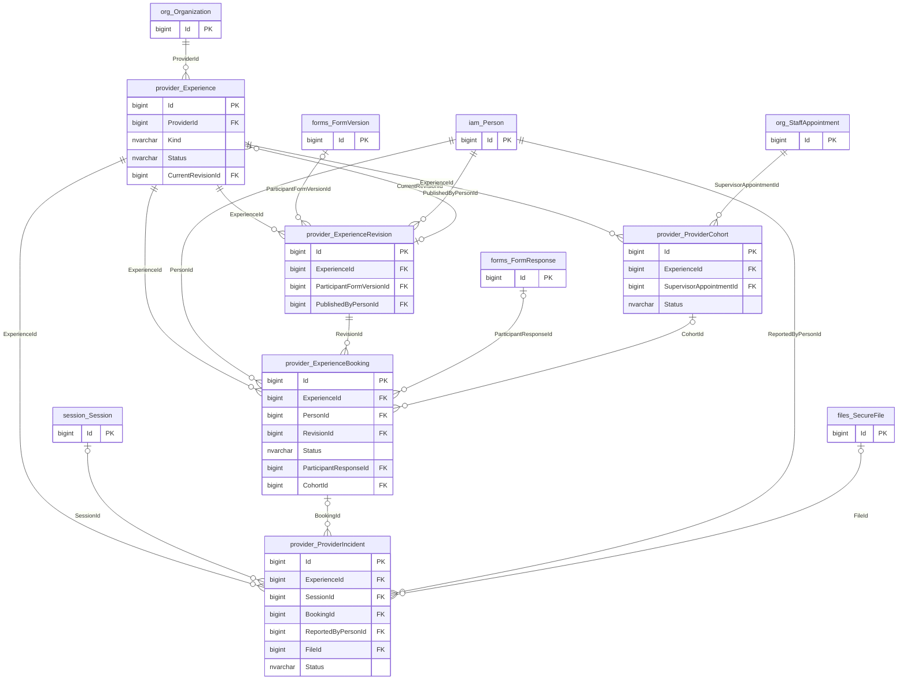
```mermaid
erDiagram
  provider_Experience {
    bigint Id PK
    bigint ProviderId FK
    nvarchar Kind
    nvarchar Status
    bigint CurrentRevisionId FK
  }
  org_Organization ||--o{ provider_Experience : "ProviderId"
  provider_ExperienceRevision |o--o{ provider_Experience : "CurrentRevisionId"
  provider_ExperienceRevision {
    bigint Id PK
    bigint ExperienceId FK
    bigint ParticipantFormVersionId FK
    bigint PublishedByPersonId FK
  }
  provider_Experience ||--o{ provider_ExperienceRevision : "ExperienceId"
  forms_FormVersion |o--o{ provider_ExperienceRevision : "ParticipantFormVersionId"
  iam_Person ||--o{ provider_ExperienceRevision : "PublishedByPersonId"
  provider_ExperienceBooking {
    bigint Id PK
    bigint ExperienceId FK
    bigint PersonId FK
    bigint RevisionId FK
    nvarchar Status
    bigint ParticipantResponseId FK
    bigint CohortId FK
  }
  provider_Experience ||--o{ provider_ExperienceBooking : "ExperienceId"
  iam_Person ||--o{ provider_ExperienceBooking : "PersonId"
  provider_ExperienceRevision ||--o{ provider_ExperienceBooking : "RevisionId"
  forms_FormResponse |o--o{ provider_ExperienceBooking : "ParticipantResponseId"
  provider_ProviderCohort |o--o{ provider_ExperienceBooking : "CohortId"
  provider_ProviderCohort {
    bigint Id PK
    bigint ExperienceId FK
    bigint SupervisorAppointmentId FK
    nvarchar Status
  }
  provider_Experience ||--o{ provider_ProviderCohort : "ExperienceId"
  org_StaffAppointment ||--o{ provider_ProviderCohort : "SupervisorAppointmentId"
  provider_ProviderIncident {
    bigint Id PK
    bigint ExperienceId FK
    bigint SessionId FK
    bigint BookingId FK
    bigint ReportedByPersonId FK
    bigint FileId FK
    nvarchar Status
  }
  provider_Experience ||--o{ provider_ProviderIncident : "ExperienceId"
  session_Session |o--o{ provider_ProviderIncident : "SessionId"
  provider_ExperienceBooking |o--o{ provider_ProviderIncident : "BookingId"
  iam_Person ||--o{ provider_ProviderIncident : "ReportedByPersonId"
  files_SecureFile |o--o{ provider_ProviderIncident : "FileId"
  org_Organization {
    bigint Id PK
  }
  forms_FormVersion {
    bigint Id PK
  }
  iam_Person {
    bigint Id PK
  }
  forms_FormResponse {
    bigint Id PK
  }
  org_StaffAppointment {
    bigint Id PK
  }
  session_Session {
    bigint Id PK
  }
  files_SecureFile {
    bigint Id PK
  }
```

## 14. forms

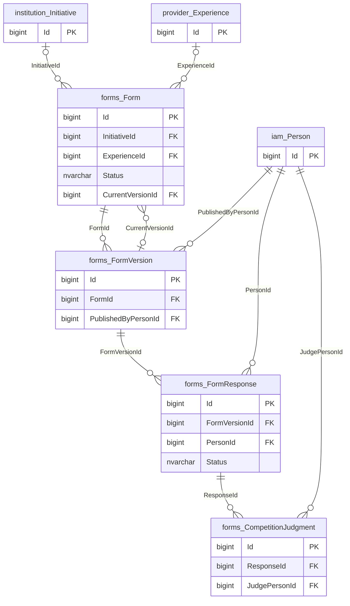
```mermaid
erDiagram
  forms_Form {
    bigint Id PK
    bigint InitiativeId FK
    bigint ExperienceId FK
    nvarchar Status
    bigint CurrentVersionId FK
  }
  institution_Initiative |o--o{ forms_Form : "InitiativeId"
  provider_Experience |o--o{ forms_Form : "ExperienceId"
  forms_FormVersion |o--o{ forms_Form : "CurrentVersionId"
  forms_FormVersion {
    bigint Id PK
    bigint FormId FK
    bigint PublishedByPersonId FK
  }
  forms_Form ||--o{ forms_FormVersion : "FormId"
  iam_Person ||--o{ forms_FormVersion : "PublishedByPersonId"
  forms_FormResponse {
    bigint Id PK
    bigint FormVersionId FK
    bigint PersonId FK
    nvarchar Status
  }
  forms_FormVersion ||--o{ forms_FormResponse : "FormVersionId"
  iam_Person ||--o{ forms_FormResponse : "PersonId"
  forms_CompetitionJudgment {
    bigint Id PK
    bigint ResponseId FK
    bigint JudgePersonId FK
  }
  forms_FormResponse ||--o{ forms_CompetitionJudgment : "ResponseId"
  iam_Person ||--o{ forms_CompetitionJudgment : "JudgePersonId"
  institution_Initiative {
    bigint Id PK
  }
  provider_Experience {
    bigint Id PK
  }
  iam_Person {
    bigint Id PK
  }
```

## 15. community

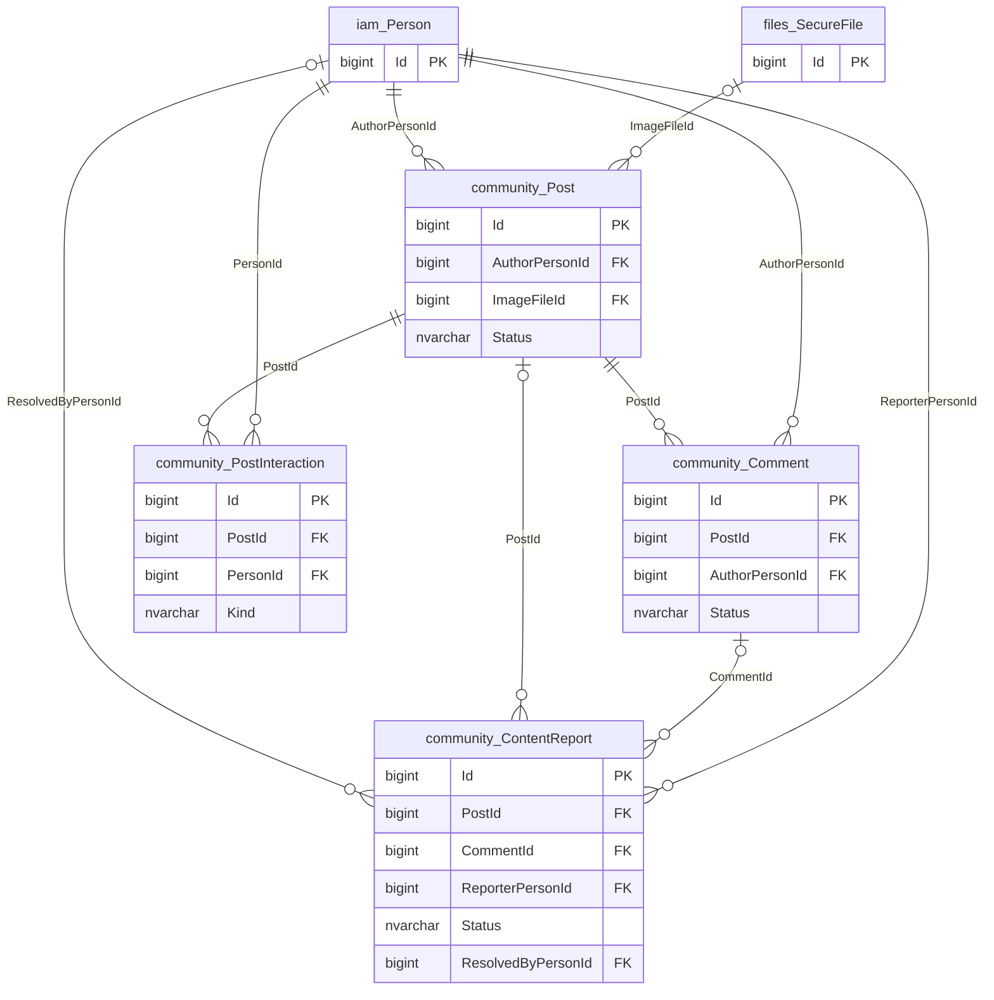
```mermaid
erDiagram
  community_Post {
    bigint Id PK
    bigint AuthorPersonId FK
    bigint ImageFileId FK
    nvarchar Status
  }
  iam_Person ||--o{ community_Post : "AuthorPersonId"
  files_SecureFile |o--o{ community_Post : "ImageFileId"
  community_Comment {
    bigint Id PK
    bigint PostId FK
    bigint AuthorPersonId FK
    nvarchar Status
  }
  community_Post ||--o{ community_Comment : "PostId"
  iam_Person ||--o{ community_Comment : "AuthorPersonId"
  community_PostInteraction {
    bigint Id PK
    bigint PostId FK
    bigint PersonId FK
    nvarchar Kind
  }
  community_Post ||--o{ community_PostInteraction : "PostId"
  iam_Person ||--o{ community_PostInteraction : "PersonId"
  community_ContentReport {
    bigint Id PK
    bigint PostId FK
    bigint CommentId FK
    bigint ReporterPersonId FK
    nvarchar Status
    bigint ResolvedByPersonId FK
  }
  iam_Person |o--o{ community_ContentReport : "ResolvedByPersonId"
  community_Post |o--o{ community_ContentReport : "PostId"
  community_Comment |o--o{ community_ContentReport : "CommentId"
  iam_Person ||--o{ community_ContentReport : "ReporterPersonId"
  iam_Person {
    bigint Id PK
  }
  files_SecureFile {
    bigint Id PK
  }
```

## 16. partnership

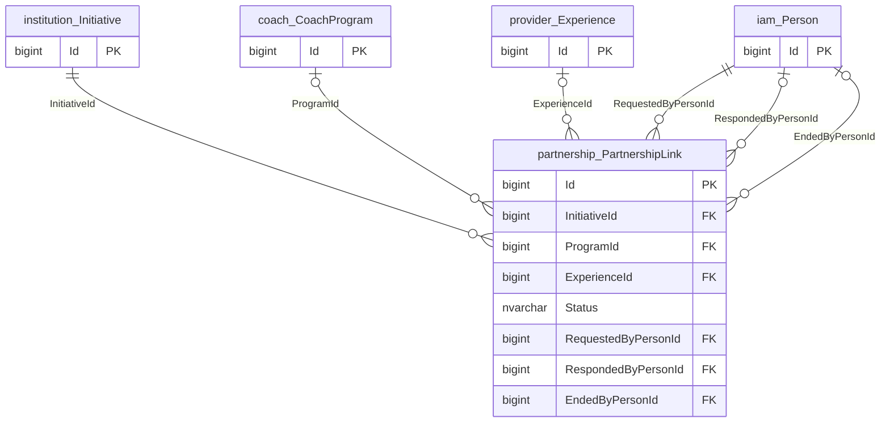
```mermaid
erDiagram
  partnership_PartnershipLink {
    bigint Id PK
    bigint InitiativeId FK
    bigint ProgramId FK
    bigint ExperienceId FK
    nvarchar Status
    bigint RequestedByPersonId FK
    bigint RespondedByPersonId FK
    bigint EndedByPersonId FK
  }
  institution_Initiative ||--o{ partnership_PartnershipLink : "InitiativeId"
  coach_CoachProgram |o--o{ partnership_PartnershipLink : "ProgramId"
  provider_Experience |o--o{ partnership_PartnershipLink : "ExperienceId"
  iam_Person ||--o{ partnership_PartnershipLink : "RequestedByPersonId"
  iam_Person |o--o{ partnership_PartnershipLink : "RespondedByPersonId"
  iam_Person |o--o{ partnership_PartnershipLink : "EndedByPersonId"
  institution_Initiative {
    bigint Id PK
  }
  coach_CoachProgram {
    bigint Id PK
  }
  provider_Experience {
    bigint Id PK
  }
  iam_Person {
    bigint Id PK
  }
```

## 17. governance

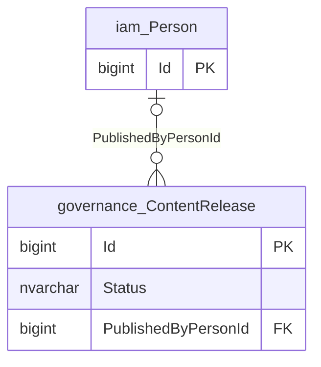
```mermaid
erDiagram
  governance_ContentRelease {
    bigint Id PK
    nvarchar Status
    bigint PublishedByPersonId FK
  }
  iam_Person |o--o{ governance_ContentRelease : "PublishedByPersonId"
  iam_Person {
    bigint Id PK
  }
```

## 18. ops

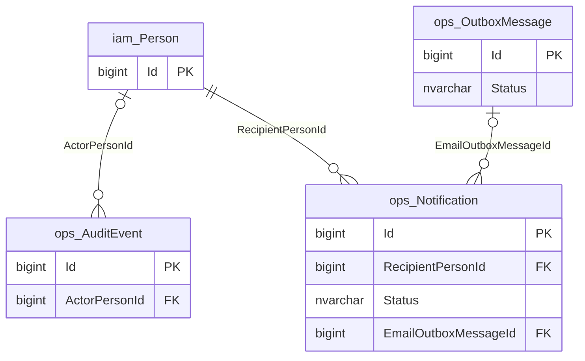
```mermaid
erDiagram
  ops_AuditEvent {
    bigint Id PK
    bigint ActorPersonId FK
  }
  iam_Person |o--o{ ops_AuditEvent : "ActorPersonId"
  ops_Notification {
    bigint Id PK
    bigint RecipientPersonId FK
    nvarchar Status
    bigint EmailOutboxMessageId FK
  }
  iam_Person ||--o{ ops_Notification : "RecipientPersonId"
  ops_OutboxMessage |o--o{ ops_Notification : "EmailOutboxMessageId"
  ops_OutboxMessage {
    bigint Id PK
    nvarchar Status
  }
  iam_Person {
    bigint Id PK
  }
```

## 19. files

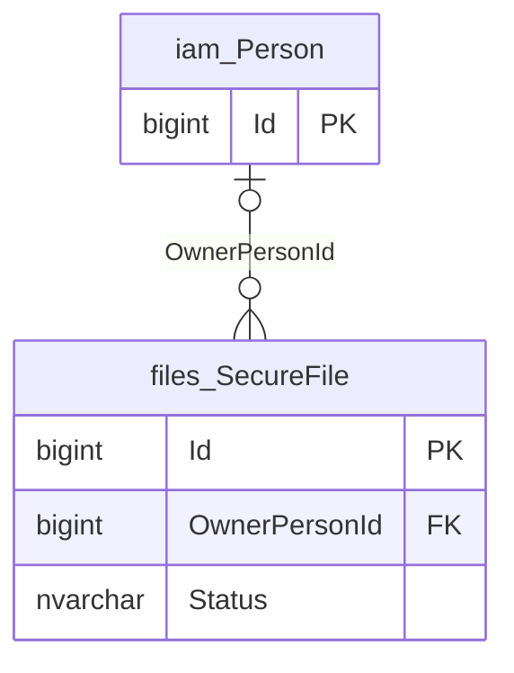
```mermaid
erDiagram
  files_SecureFile {
    bigint Id PK
    bigint OwnerPersonId FK
    nvarchar Status
  }
  iam_Person |o--o{ files_SecureFile : "OwnerPersonId"
  iam_Person {
    bigint Id PK
  }
```

